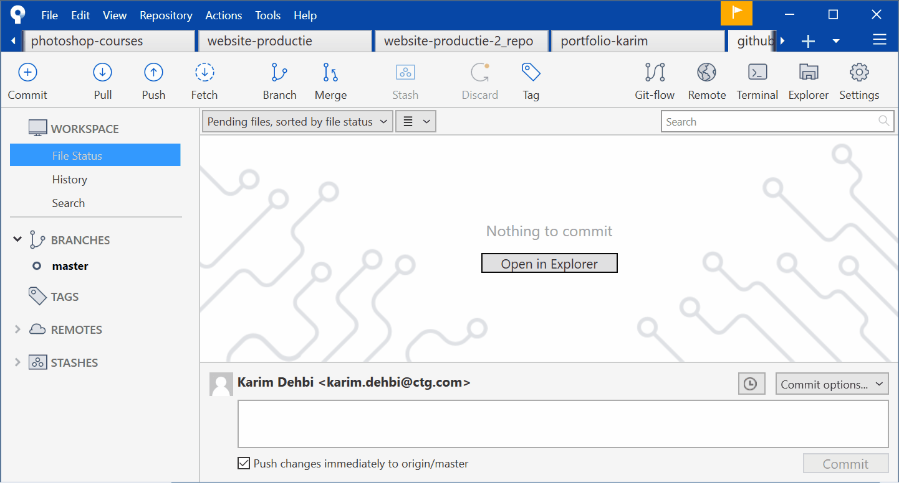
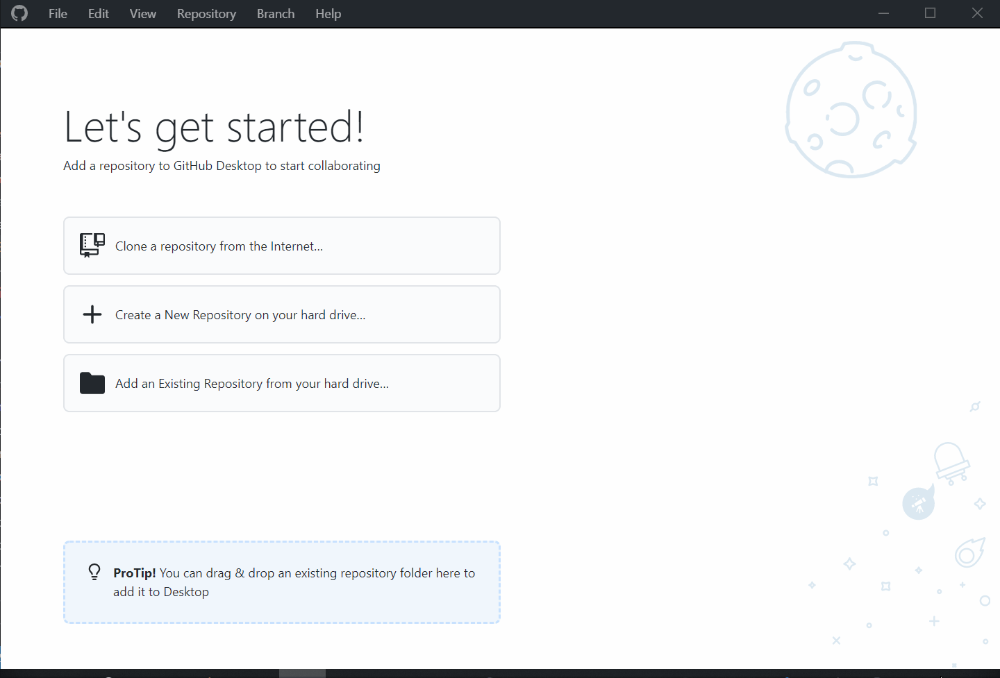

# Les 1: Herhaling & Tooling

## 1. Tooling

Er zijn verschillende applicaties & websites die ons goed kunnen helpen bij het leren ontwikkelen van websites. Voor deze les gaan we een account maken bij GitHub. Vervolgens gebruiken we dezelfde account voor CodePen. Er volgt een video die uitlegt hoe je dit doet.

### GitHub

#### Intro

We gaan later zelf ook GitHub leren gebruiken, maar de hoofdreden dat ik jullie nu vraag een account te maken is zodat je met je GitHub account op een heel groot aantal verschillende web technology gerelateerde websites kan inloggen en dan moet je niet telkens een nieuwe account maken.

Deze cursus is overigens ook een repository / online folder die op GitHub staat.

#### Wikipedia uitleg

**GitHub** is een online platform waar [software](https://nl.wikipedia.org/wiki/Software "Software") op kan worden geplaatst. GitHub is gebouwd rond het [Git](https://nl.wikipedia.org/wiki/Git_(software) "Git (software)")-[versiebeheersysteem](https://nl.wikipedia.org/wiki/Versiebeheersysteem "Versiebeheersysteem"), waardoor GitHub alle mogelijkheden van [Git](https://nl.wikipedia.org/wiki/Git_(software) "Git (software)") en eigen toevoegingen aanbiedt.

Het beschikt onder ander over [toegangscontrole](https://nl.wikipedia.org/wiki/Toegangscontrole "Toegangscontrole") en verschillende samenwerkingsfuncties, zoals een [issue tracker](https://nl.wikipedia.org/wiki/Issue_tracker "Issue tracker"), een forum voor het aanvragen van functies, takenlijsten en [wiki](https://nl.wikipedia.org/wiki/Wiki "Wiki")'s voor ieder project.[[2]](https://nl.wikipedia.org/wiki/GitHub#cite_note-2)

Op GitHub staat veel [opensourcesoftware](https://nl.wikipedia.org/wiki/Opensourcesoftware "Opensourcesoftware") omdat bij openbare repositories de [broncode](https://nl.wikipedia.org/wiki/Broncode "Broncode") kan worden ingekeken door derden.

GitHub biedt zowel gratis als betaalde abonnementen. Om privé-projecten te kunnen hosten op GitHub is sinds 8 januari 2019 geen betaald abonnement meer nodig.[[3]](https://nl.wikipedia.org/wiki/GitHub#cite_note-3)

De mascotte van GitHub is _Octocat_, een [geantropomorfiseerde](https://nl.wikipedia.org/wiki/Antropomorfisme "Antropomorfisme") kat met octopusachtige-ledematen.[[4]](https://nl.wikipedia.org/wiki/GitHub#cite_note-4)

GitHub is geschreven in _[Ruby on Rails](https://nl.wikipedia.org/wiki/Ruby_on_Rails "Ruby on Rails")_ en [Erlang](https://nl.wikipedia.org/wiki/Erlang_(programmeertaal) "Erlang (programmeertaal)") door Chris Wanstrath, P. J. Hyett en Tom Preston-Werner.

### SourceTree

Om Git te gebruiken, is het handige om een visuele Git Client te hebben. Hiervoor zullen we SourceTree gebruiken.

[https://www.sourcetreeapp.com/](https://www.sourcetreeapp.com/)

### Visual Studio Code

Ik ga er van uit dat de meesten al reeds Visual Studio Code geïnstalleerd hebben. We gaan deze module ook opnieuw uitgebreid gebruik maken van Visual Studio Code. Zie link hieronder voor meer info:

[https://goldflow.github.io/website-productie/visual-code-extensions.html](https://goldflow.github.io/website-productie/visual-code-extensions.html)

## 2. Voorbereiding

### Repository uitleg

Repository = een soort van online map / folder waarin bestanden staan. 

We kunnen hier op onze eigen computer lokaal een kopie van maken. Eenmaal we veranderingen hebben aangebracht in onze kopie, kunnen we zorgen dat de onze veranderingen worden "gesynct" / gelijkgesteld met die van de online map. Met andere woorden ervoor zorgen dat de online versie en onze lokale versie dezelfde blijven.

### Overzicht benodigdheden

Het volgende moet reeds gedaan zijn voor je verder kan gaan:

* GitHub account aangemaakt; gelieve je profiel te delen met mij anders zal je de opdracht niet kunnen uitvoeren.
* SourceTree geïnstalleerd (in geval van Mac mag je ook opteren voor Github Desktop)
* je bent met je GitHub account geauthenticeerd in je Git Client (SourceTree of Github Desktop)

### Authenticatie in SourceTree

Het is belangrijk dat je binnen SourceTree geauthenticeerd bent met je GitHub account, alleen dan zal je met success de verdere stappen kunnen uitvoeren.

Stappen:

* Open Sourcetree
* klik op "Tools", dan op het submenu "Options"
* dan klik je op het tabblad "Authentication"
* klik op "Add" 
* selecteer "Github" en kies "OAuth" (staat normaal gezien als standaard ingesteld)
* klik op "Connect Account"

<video width="600" controls>
<source src="github-auth-fixen.mkv">
</video>

### Authenticatie in Github Desktop

Authenticeren in Github Desktop gebeurt gelijkaardig

### Visual Studio plugin GitLens (optioneel)

Het is ook mogelijk om Git te gebruiken in Visual Studio. De extensie [GitLens](https://marketplace.visualstudio.com/items?itemName=eamodio.gitlens) kan je hierbij helpen.

### Git gebruiken via commandline (optioneel)

Voor de mensen die verkiezen met commandline / terminal te werken (typ cmd in verkenner of voor Mac zoek naar 'Terminal')

Kan je meer info hier vinden:

[GIT gebruik via commandline](https://rogerdudler.github.io/git-guide/index.nl.html)

---

### Gebruik van GIT

Voor je verdergaat, lees eerst meer over wat git is en hoe je het gebruikt. Het is normaal dat je nog niet alles zal begrijpen maar het is belangrijk dat je dit al eens doorneemt.

Zie onderstaande link voor meer info:

## 3. Oefeningen om Git te leren gebruiken

### Repository creatie

Hier leg ik uit hoe we onze eerste repository crëeren.

<video width="600" controls>
<source src="create-repository.mkv">
</video>

#### Repository clonen in SourceTree

Hier leg ik uit hoe je een repository kan 'clonen' in SourceTree. We gaan met andere woorden lokaal een kopie maken van een map die online staat.

<video width="600" controls>
<source src="clone-repo-in-source-tree.mkv">
</video>

#### De map die gelinkt is aan je repository terugvinden op je PC

Hier leg ik uit hoe je de repository kan terugvinden in je systeem vanuit SourceTree

<video width="600" controls>
<source src="locate-repo-on-pc.mkv">
</video>

#### Hoe je een verandering maakt op je repository

Hier leg ik uit hoe je veranderingen kan maken in je repository

<video width="600" controls>
<source src="first-commit.mkv">
</video>

### Oefening: Maak een account op GitHub

Voor de cursisten die Website Productie 1 hebben meegevolgd, zou je normaal al reeds je GitHub account moeten hebben.

[https://github.com/](https://github.com/)

Vervolgens mag je je GitHub account delen met mij.

### Opdracht: Portfolio 2.0 op GitHub

We gaan de eindopdracht van Website Productie 1 opnieuw gebruiken om enkele nieuwe zaken aan te leren. We gaan onze Portfolio op Github plaatsen en die dan online zetten via Netlify.

Vereisten:
* Alle HTML in alle pagina's moet volledig valid zijn volgens W3 regels. Anders wordt de website niet verbeterd; zie sectie [Praktisch Advies](../praktisch-advies)
* Website moet op Github terecht komen
* Je zet de website online via Github door gebruik te maken van Netlify

### Opdracht: Profiel in een gedeelde repository plaatsen

https://goldflow.github.io/website-productie/opdracht-profiel/