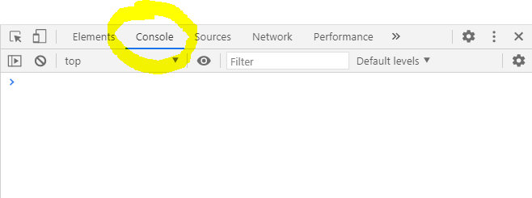

# Les 2: JavaScript Introducie

## 1. Introductie & Tooling

Er zijn verschillende applicaties & websites die ons goed kunnen helpen bij het leren ontwikkelen van JavaScript.

### Visual Studio Code

Dit hebben we reeds meerdere keren gebruikt in deze opleiding. [Link naar pagina met meer informatie.]([../visual-code-extensions.md](https://goldflow.github.io/website-productie-2/visual-code-extensions.html))

### Browser

Om het resultaat van onze oefeningen te zien, maken we gebruik van browsers.

### Developer Tools

Developer tools openen in de meeste browsers door op de snelkoppeling F12 te drukken.

Ook door op een webpagina te klikken op "Inspect" / "Inspecteer" / "Inspecter", kan je de developer tools terugvinden.

Dit ziet er zo uit in Google Chrome:



### Wat is JavaScript

<font style="vertical-align: inherit;"><font style="vertical-align: inherit;">JavaScript is een script- of programmeertaal waarmee je complexe functies op webpagina's kunt implementeren - elke keer dat een webpagina meer doet dan alleen maar stilstaan ​​en statische informatie weergeven die je kunt bekijken - met tijdige inhoudsupdates, interactieve kaarten, geanimeerde 2D / 3D-graphics enz. - je kunt er zeker van zijn dat JavaScript er waarschijnlijk bij betrokken is. </font>

<font style="vertical-align: inherit;">Het is de derde laag van de laagcake van standaard webtechnologieën, waarvan </font><font style="vertical-align: inherit;">we er </font><font style="vertical-align: inherit;">twee ( </font></font>[<font style="vertical-align: inherit;"><font style="vertical-align: inherit;">HTML</font></font>](https://developer.mozilla.org/en-US/docs/Learn/HTML)
<font style="vertical-align: inherit;"><font style="vertical-align: inherit;"> en </font></font>[<font style="vertical-align: inherit;"><font style="vertical-align: inherit;">CSS</font></font>](https://developer.mozilla.org/en-US/docs/Learn/CSS)
<font style="vertical-align: inherit;"><font style="vertical-align: inherit;"> ) veel gedetailleerder hebben behandeld in andere delen van Website Productie 1.</font></font>


* [<font style="vertical-align: inherit;"><font style="vertical-align: inherit;">HTML</font></font>](https://developer.mozilla.org/en-US/docs/Glossary/HTML)

    <font style="vertical-align: inherit;"><font style="vertical-align: inherit;"> is de opmaaktaal die we gebruiken om onze webinhoud te structureren en betekenis te geven, bijvoorbeeld door alinea's, koppen en gegevenstabellen te definiëren of afbeeldingen en video's in de pagina in te sluiten.</font></font>

* [<font style="vertical-align: inherit;"><font style="vertical-align: inherit;">CSS</font></font>](https://developer.mozilla.org/en-US/docs/Glossary/CSS)

    <font style="vertical-align: inherit;"><font style="vertical-align: inherit;"> is een taal van stijlregels die we gebruiken om stijl toe te passen op onze HTML-inhoud, bijvoorbeeld door achtergrondkleuren en lettertypen in te stellen en onze inhoud in meerdere kolommen op te delen.</font></font>

* [<font style="vertical-align: inherit;"><font style="vertical-align: inherit;">JavaScript</font></font>](https://developer.mozilla.org/en-US/docs/Glossary/JavaScript)

    <font style="vertical-align: inherit;"><font style="vertical-align: inherit;"> is een scripttaal waarmee je dynamisch bijgewerkte inhoud kunt maken, multimedia kunt beheren, afbeeldingen kunt animeren en vrijwel al het andere. </font><font style="vertical-align: inherit;">(Oké, niet alles, maar het is verbazingwekkend wat je kunt bereiken met een paar regels JavaScript-code.)</font></font>

<font style="vertical-align: inherit;"><font style="vertical-align: inherit;">De drie lagen bouwen mooi over elkaar heen. </font><font style="vertical-align: inherit;">Laten we een eenvoudig tekstlabel als voorbeeld nemen. </font><font style="vertical-align: inherit;">We kunnen het markeren met HTML om het structuur en doel te geven:</font></font>

```
<p>Player 1: Chris</p>
```


<font style="vertical-align: inherit;"><font style="vertical-align: inherit;">Vervolgens kunnen we wat CSS aan de mix toevoegen om het er goed uit te laten zien:</font></font>

```
p {
  font-family: 'helvetica neue', helvetica, sans-serif;
  letter-spacing: 1px;
  text-transform: uppercase;
  text-align: center;
  border: 2px solid rgba(0,0,200,0.6);
  background: rgba(0,0,200,0.3);
  color: rgba(0,0,200,0.6);
  box-shadow: 1px 1px 2px rgba(0,0,200,0.4);
  border-radius: 10px;
  padding: 3px 10px;
  display: inline-block;
  cursor: pointer;
}
```


<font style="vertical-align: inherit;"><font style="vertical-align: inherit;">En tot slot kunnen we wat JavaScript toevoegen om dynamisch gedrag te implementeren:</font></font>

```
const para = document.querySelector('p');

para.addEventListener('click', updateName);

function updateName() {
  let name = prompt('Enter a new name');
  para.textContent = 'Player 1: ' + name;
}
```

[Zie deze CodePen om dit eens uit te proberen](https://codepen.io/GoldFlow/pen/OJRKXLZ)


### Geschiedenis

[Lees meer over de geschiedenis van JavaScript hier](https://en.wikipedia.org/wiki/JavaScript#History
)

Je zal hier meer over leren in de cursus van Udacity.

## Dus wat kan het echt doen?

<font style="vertical-align: inherit;"><font style="vertical-align: inherit;">De kern JavaScript-taal aan de clientzijde bestaat uit enkele algemene programmeerfuncties waarmee u dingen kunt doen als:</font></font>

* <font style="vertical-align: inherit;"><font style="vertical-align: inherit;">Bewaar nuttige waarden in variabelen. </font><font style="vertical-align: inherit;">In het bovenstaande voorbeeld vragen we bijvoorbeeld om een ​​nieuwe naam in te voeren en die naam vervolgens op te slaan in een variabele met de naam </font></font>`name`

    <font style="vertical-align: inherit;"><font style="vertical-align: inherit;">.</font></font>

* <font style="vertical-align: inherit;"><font style="vertical-align: inherit;">Bewerkingen aan stukjes tekst (bekend als "strings" in programmeren). </font><font style="vertical-align: inherit;">In het bovenstaande voorbeeld nemen we de string "Speler 1:" en voegen deze toe aan de </font></font>`name`

    <font style="vertical-align: inherit;"><font style="vertical-align: inherit;">variabele om het volledige tekstlabel te creëren, bijv. '' Speler 1: Chris ".</font></font>

* <font style="vertical-align: inherit;"><font style="vertical-align: inherit;">Code uitvoeren als reactie op bepaalde gebeurtenissen op een webpagina. </font><font style="vertical-align: inherit;">We hebben een </font></font>`[click](https://developer.mozilla.org/en-US/docs/Web/Events/click "/en-US/docs/Web/Events/click")`

    <font style="vertical-align: inherit;"><font style="vertical-align: inherit;">gebeurtenis in ons bovenstaande voorbeeld gebruikt om te detecteren wanneer op de knop wordt geklikt en vervolgens de code uit te voeren die het tekstlabel bijwerkt.</font></font>

* <font style="vertical-align: inherit;"><font style="vertical-align: inherit;">En veel meer!</font></font>

<font style="vertical-align: inherit;"><font style="vertical-align: inherit;">Wat echter nog spannender is, is de functionaliteit die bovenop de client-side JavaScript-taal is gebouwd. </font><font style="vertical-align: inherit;">Zogenaamde </font></font>**<font style="vertical-align: inherit;"><font style="vertical-align: inherit;">Application Programming Interfaces</font></font>**
<font style="vertical-align: inherit;"><font style="vertical-align: inherit;"> ( </font></font>**<font style="vertical-align: inherit;"><font style="vertical-align: inherit;">API's</font></font>**
<font style="vertical-align: inherit;"><font style="vertical-align: inherit;"> ) geven je extra superkrachten om in je JavaScript-code te gebruiken.</font></font>

<font style="vertical-align: inherit;"><font style="vertical-align: inherit;">API's zijn kant-en-klare sets code-bouwstenen waarmee een ontwikkelaar programma's kan implementeren die anders moeilijk of onmogelijk te implementeren zouden zijn. </font><font style="vertical-align: inherit;">Ze doen hetzelfde voor het programmeren dat kant-en-klare meubelkits doen voor het bouwen van huizen - het is veel gemakkelijker om kant-en-klare panelen te nemen en ze aan elkaar te schroeven om een ​​boekenplank te maken dan om het ontwerp zelf uit te werken, ga op zoek naar de correct hout, zaag alle panelen op de juiste maat en vorm, zoek de juiste maat schroeven en </font><font style="vertical-align: inherit;">zet ze </font></font>_<font style="vertical-align: inherit;"><font style="vertical-align: inherit;">vervolgens</font></font>_
<font style="vertical-align: inherit;"><font style="vertical-align: inherit;"> in elkaar om een ​​boekenplank te maken.</font></font>

<font style="vertical-align: inherit;"><font style="vertical-align: inherit;">Ze vallen over het algemeen in twee categorieën.</font></font>


**<font style="vertical-align: inherit;"><font style="vertical-align: inherit;">Browser-API's</font></font>**
<font style="vertical-align: inherit;"><font style="vertical-align: inherit;"> zijn ingebouwd in uw webbrowser en kunnen gegevens uit de omringende computeromgeving vrijgeven of nuttige complexe dingen doen. </font><font style="vertical-align: inherit;">Bijvoorbeeld:</font></font>

* <font style="vertical-align: inherit;"><font style="vertical-align: inherit;">Het </font></font>[`DOM (Document Object Model) API`](https://developer.mozilla.org/en-US/docs/Web/API/Document_Object_Model)

    <font style="vertical-align: inherit;"><font style="vertical-align: inherit;">stelt u in staat om HTML en CSS te manipuleren, creëren, verwijderen en wijzigen van HTML, dynamisch toepassen van nieuwe stijlen om uw pagina, etc. Elke keer zie je een pop-up venster op een pagina, of een nieuwe inhoud die wordt weergegeven (zoals we hierboven zagen onze eenvoudige demo), dat is bijvoorbeeld de DOM in actie.</font></font>

* <font style="vertical-align: inherit;"><font style="vertical-align: inherit;">Het </font></font>[`Geolocation API`](https://developer.mozilla.org/en-US/docs/Web/API/Geolocation)

    <font style="vertical-align: inherit;"><font style="vertical-align: inherit;">haalt geografische informatie op. </font><font style="vertical-align: inherit;">Dit is hoe </font></font>[<font style="vertical-align: inherit;"><font style="vertical-align: inherit;">Google Maps</font></font>](https://www.google.com/maps)

    <font style="vertical-align: inherit;"><font style="vertical-align: inherit;"> uw locatie kan vinden en deze op een kaart kan plotten.</font></font>

* <font style="vertical-align: inherit;"><font style="vertical-align: inherit;">Met de </font></font>[`Canvas`](https://developer.mozilla.org/en-US/docs/Web/API/Canvas_API)

    <font style="vertical-align: inherit;"><font style="vertical-align: inherit;">en </font></font>[`WebGL`](https://developer.mozilla.org/en-US/docs/Web/API/WebGL_API)

    <font style="vertical-align: inherit;"><font style="vertical-align: inherit;">API's kunt u geanimeerde 2D- en 3D-afbeeldingen maken. </font><font style="vertical-align: inherit;">Mensen doen verbazingwekkende dingen met behulp van deze webtechnologieën - zie </font></font>[<font style="vertical-align: inherit;"><font style="vertical-align: inherit;">Chrome-experimenten</font></font>](https://www.chromeexperiments.com/webgl)

**<font style="vertical-align: inherit;"><font style="vertical-align: inherit;">API's van derden</font></font>**
<font style="vertical-align: inherit;"><font style="vertical-align: inherit;"> zijn niet standaard in de browser ingebouwd en u moet hun code en informatie meestal ergens op internet ophalen. </font><font style="vertical-align: inherit;">Bijvoorbeeld:</font></font>

* <font style="vertical-align: inherit;"><font style="vertical-align: inherit;">Met de </font></font>[<font style="vertical-align: inherit;"><font style="vertical-align: inherit;">Twitter API</font></font>](https://dev.twitter.com/overview/documentation)

    <font style="vertical-align: inherit;"><font style="vertical-align: inherit;"> kun je dingen doen zoals het weergeven van je laatste tweets op je website.</font></font>

* <font style="vertical-align: inherit;"><font style="vertical-align: inherit;">Met de </font></font>[<font style="vertical-align: inherit;"><font style="vertical-align: inherit;">Google Maps API</font></font>](https://developers.google.com/maps/)

    <font style="vertical-align: inherit;"><font style="vertical-align: inherit;"> en </font></font>[<font style="vertical-align: inherit;"><font style="vertical-align: inherit;">OpenStreetMap API</font></font>](https://wiki.openstreetmap.org/wiki/API)

    <font style="vertical-align: inherit;"><font style="vertical-align: inherit;"> kunt u aangepaste kaarten in uw website insluiten, en andere soortgelijke functies.</font></font>

## Wat doet JavaScript op je pagina?

<font style="vertical-align: inherit;"><font style="vertical-align: inherit;">Hier gaan we eigenlijk naar wat code kijken, en terwijl we dit doen, onderzoeken we wat er feitelijk gebeurt als je wat JavaScript op je pagina uitvoert.</font></font>

<font style="vertical-align: inherit;"><font style="vertical-align: inherit;">Laten we kort het verhaal samenvatten van wat er gebeurt als u een webpagina in een browser laadt.
<font style="vertical-align: inherit;"><font style="vertical-align: inherit;"> ). </font><font style="vertical-align: inherit;">Wanneer u een webpagina in uw browser laadt, voert u uw code (de HTML, CSS en JavaScript) uit in een uitvoeringsomgeving (het browsertabblad). </font><font style="vertical-align: inherit;">Dit is als een fabriek die grondstoffen opneemt (de code) en een product produceert (de webpagina).</font></font>


<font style="vertical-align: inherit;"><font style="vertical-align: inherit;">JavaScript wordt veel gebruikt om HTML en CSS dynamisch te wijzigen om een ​​gebruikersinterface bij te werken, via de Document Object Model API (zoals hierboven vermeld). </font><font style="vertical-align: inherit;">Merk op dat de code in uw webdocumenten over het algemeen wordt geladen en uitgevoerd in de volgorde waarin deze op de pagina wordt weergegeven. </font><font style="vertical-align: inherit;">Als JavaScript wordt geladen en probeert uit te voeren voordat de HTML en CSS die het beïnvloedt, is geladen, kunnen er fouten optreden. </font><font style="vertical-align: inherit;">Later in het artikel, in het </font><font style="vertical-align: inherit;">gedeelte </font></font>[<font style="vertical-align: inherit;"><font style="vertical-align: inherit;">Strategieën voor</font></font>](https://developer.mozilla.org/en-US/docs/Learn/JavaScript/First_steps/What_is_JavaScript#Script_loading_strategies)
<font style="vertical-align: inherit;"><font style="vertical-align: inherit;"> het </font><a href="/en-US/docs/Learn/JavaScript/First_steps/What_is_JavaScript#Script_loading_strategies"><font style="vertical-align: inherit;">laden van scripts</font></a><font style="vertical-align: inherit;"> , leert u hoe u dit kunt doen </font><font style="vertical-align: inherit;">.</font></font>

## JavaScript-startvolgorde

<font style="vertical-align: inherit;"><font style="vertical-align: inherit;">Wanneer de browser een blok JavaScript tegenkomt, voert deze dit over het algemeen in volgorde uit, van boven naar beneden. </font><font style="vertical-align: inherit;">Dit betekent dat je voorzichtig moet zijn in de volgorde waarin je de dingen plaatst. Laten we bijvoorbeeld teruggaan naar het blok JavaScript dat we in ons eerste voorbeeld zagen:</font></font>

```
const para = document.querySelector('p');

para.addEventListener('click', updateName);

function updateName() {
  let name = prompt('Enter a new name');
  para.textContent = 'Player 1: ' + name;
}
```

<font style="vertical-align: inherit;"><font style="vertical-align: inherit;">Hier selecteren we een tekstparagraaf (regel 1) en voegen er vervolgens een gebeurtenislistener aan toe (regel 3), zodat wanneer op de alinea wordt geklikt, het </font></font>`updateName()`
<font style="vertical-align: inherit;"><font style="vertical-align: inherit;">codeblok (regels 5-8) wordt uitgevoerd. </font><font style="vertical-align: inherit;">Het </font></font>`updateName()`
<font style="vertical-align: inherit;"><font style="vertical-align: inherit;">codeblok (dit soort herbruikbare codeblokken worden "functies" genoemd) vraagt ​​de gebruiker om een ​​nieuwe naam en voegt die naam vervolgens in de alinea in om de weergave bij te werken.</font></font>

<font style="vertical-align: inherit;"><font style="vertical-align: inherit;">Als je de volgorde van de eerste twee regels code zou verwisselen, zou het niet meer werken - in plaats daarvan zou je een foutmelding krijgen in de </font></font>[<font style="vertical-align: inherit;"><font style="vertical-align: inherit;">ontwikkelaarsconsole van</font></font>](https://developer.mozilla.org/en-US/docs/Learn/Common_questions/What_are_browser_developer_tools)
<font style="vertical-align: inherit;"><font style="vertical-align: inherit;"> de </font><a href="/en-US/docs/Learn/Common_questions/What_are_browser_developer_tools"><font style="vertical-align: inherit;">browser</font></a><font style="vertical-align: inherit;"> - </font></font>`TypeError: para is undefined`
<font style="vertical-align: inherit;"><font style="vertical-align: inherit;">. </font><font style="vertical-align: inherit;">Dit betekent dat het </font></font>`para`
<font style="vertical-align: inherit;"><font style="vertical-align: inherit;">object nog niet bestaat, dus we kunnen er geen gebeurtenislistener aan toevoegen.</font></font>

## Hoe voeg je JavaScript toe aan je pagina?

JavaScript wordt op dezelfde manier als CSS op uw HTML-pagina toegepast. Waar CSS <link>elementen gebruikt om externe stylesheets toe te passen en <style>elementen om interne stylesheets op HTML toe te passen, heeft JavaScript in de wereld van HTML maar één vriend nodig: het <script>element. Laten we eens kijken hoe dit werkt.

### Intern JavaScript

1.  <font style="vertical-align: inherit;"><font style="vertical-align: inherit;">Maak allereerst een lokale kopie van ons voorbeeldbestand </font></font>[<font style="vertical-align: inherit;"><font style="vertical-align: inherit;">apply-javascript.html</font></font>](https://github.com/mdn/learning-area/blob/master/javascript/introduction-to-js-1/what-is-js/apply-javascript.html)

    <font style="vertical-align: inherit;"><font style="vertical-align: inherit;"> . </font><font style="vertical-align: inherit;">Bewaar het ergens in een verstandige directory.</font></font>

2.  <font style="vertical-align: inherit;"><font style="vertical-align: inherit;">Open het bestand in uw webbrowser en in uw teksteditor. </font><font style="vertical-align: inherit;">U zult zien dat de HTML een eenvoudige webpagina maakt met een klikbare knop.</font></font>
3.  <font style="vertical-align: inherit;"><font style="vertical-align: inherit;">Ga vervolgens naar je teksteditor en voeg het volgende toe in je hoofd - net voor je afsluitende </font></font>`</head>`

    <font style="vertical-align: inherit;"><font style="vertical-align: inherit;">tag:
      </font></font>

    ```
    <script>

      // JavaScript goes here

    </script>
    ```

4.  <font style="vertical-align: inherit;"><font style="vertical-align: inherit;">Nu zullen we wat JavaScript in ons </font></font>[`<script>`](https://developer.mozilla.org/en-US/docs/Web/HTML/Element/script)

    <font style="vertical-align: inherit;"><font style="vertical-align: inherit;">element toevoegen om de pagina iets interessants te laten doen - voeg de volgende code toe net onder de regel "// JavaScript gaat hier":
      </font></font>

    ```
    document.addEventListener("DOMContentLoaded", function() {
      function createParagraph() {
        let para = document.createElement('p');
        para.textContent = 'You clicked the button!';
        document.body.appendChild(para);
      }

      const buttons = document.querySelectorAll('button');

      for(let i = 0; i < buttons.length ; i++) {
        buttons[i].addEventListener('click', createParagraph);
      }
    });
    ```

5.  <font style="vertical-align: inherit;"><font style="vertical-align: inherit;">Sla uw bestand op en vernieuw de browser - nu zou u moeten zien dat wanneer u op de knop klikt, er een nieuwe alinea wordt gegenereerd en hieronder wordt geplaatst.</font></font>

### Externe JavaScript

<font style="vertical-align: inherit;"><font style="vertical-align: inherit;">Dit werkt prima, maar wat als we ons JavaScript in een extern bestand wilden plaatsen? </font><font style="vertical-align: inherit;">Laten we dit nu onderzoeken.</font></font>

1.  <font style="vertical-align: inherit;"><font style="vertical-align: inherit;">Maak eerst een nieuw bestand in dezelfde map als uw HTML-voorbeeldbestand. </font><font style="vertical-align: inherit;">Noem het </font></font>`script.js`

    <font style="vertical-align: inherit;"><font style="vertical-align: inherit;">- zorg ervoor dat het de bestandsnaamextensie .js heeft, want zo wordt het herkend als JavaScript.</font></font>

2.  <font style="vertical-align: inherit;"><font style="vertical-align: inherit;">Vervang uw huidige </font></font>[`<script>`](https://developer.mozilla.org/en-US/docs/Web/HTML/Element/script)

    <font style="vertical-align: inherit;"><font style="vertical-align: inherit;">element door het volgende:
      </font></font>

    ```
    <script src="script.js" defer></script>
    ```

3.  <font style="vertical-align: inherit;"><font style="vertical-align: inherit;">Binnen </font></font>`script.js`

    <font style="vertical-align: inherit;"><font style="vertical-align: inherit;">, voeg het volgende script:
      </font></font>

    ```
    function createParagraph() {
      let para = document.createElement('p');
      para.textContent = 'You clicked the button!';
      document.body.appendChild(para);
    }

    const buttons = document.querySelectorAll('button');

    for(let i = 0; i < buttons.length ; i++) {
      buttons[i].addEventListener('click', createParagraph);
    }
    ```

4.  <font style="vertical-align: inherit;"><font style="vertical-align: inherit;">Bewaar en vernieuw uw browser, en u zou hetzelfde moeten zien! </font><font style="vertical-align: inherit;">Het werkt precies hetzelfde, maar nu hebben we ons JavaScript in een extern bestand. </font><font style="vertical-align: inherit;">Dit is over het algemeen een goede zaak in termen van het organiseren van uw code en het herbruikbaar maken voor meerdere HTML-bestanden. </font><font style="vertical-align: inherit;">Bovendien is de HTML gemakkelijker te lezen zonder dat er enorme stukken script in worden gedumpt.</font></font>


## Wat is een variabele?

Een variabele kan verschillende zaken voorstellen. Een string (stukje tekst), een cijfer, of volledig andere zaken.

Er zijn ook zaken die als een formule werken, een functie.

[Les "Wat is een variabel?" op Khan Academy](https://nl.khanacademy.org/math/cc-sixth-grade-math/cc-6th-expressions-and-variables/cc-6th-evaluating-expressions/v/what-is-a-variable)

## Resources

[https://classroom.udacity.com/courses/ud803](https://classroom.udacity.com/courses/ud803)

[resources](https://developer.mozilla.org/en-US/docs/Learn/JavaScript/First_steps/What_is_JavaScript)