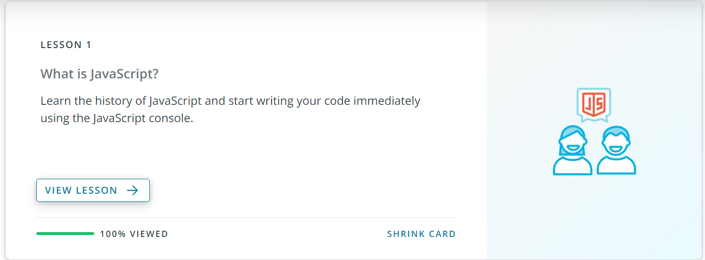
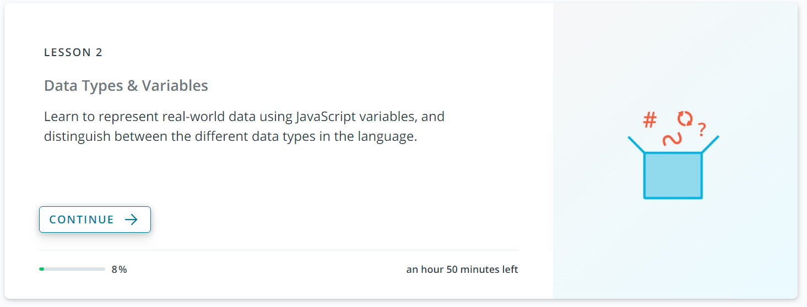

# Les 2: Self Study: Intro To Javascript

## Uitleg

Neem even onderstaande video uit om meer uitleg te krijgen over de zelfstudie:

<video width="600" controls>
<source src="selfstudy-les2.mkv">
</video>

## Hoe er aan te beginnen

Om te beginnen ga je naar deze link:

[Introductie tot Javascript op Udacity](https://www.udacity.com/course/intro-to-javascript--ud803)

En vervolgen maak je een nieuwe account.

Eenmaal je dat hebt gedaan kan je [naar de cursus zelf op Udacity gaan](https://classroom.udacity.com/courses/ud803).

## Wat precies doornemen?

De cursus bestaan uit verschillende lessen (lessons). Gelieve Les 1 & 2 te doen. Ze moeten op 100% staan.
Ik zal hier binnenkort nog een test op geven.

Dus neem de lessen door tot en met Lesson 2
