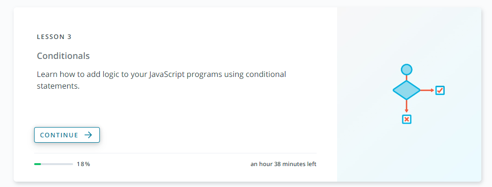

# Les 3: Self Study: Conditionals

## Uitleg

Neem even onderstaande video uit om meer uitleg te krijgen over de zelfstudie:

<video width="600" controls>
<source src="selfstudy-les2.mkv">
</video>

## Hoe er aan te beginnen

Om te beginnen ga je [naar de cursus zelf op Udacity gaan](https://classroom.udacity.com/courses/ud803).

## Wat precies doornemen?

De cursus bestaan uit verschillende lessen (lessons). Gelieve Les 3 door te nemen. Ze moeten op 100% staan.

Belangrijk dat je de lessen hiervoor ook al hebt doorgenomen.

Ik zal hier binnenkort nog een test op geven.

Dus neem de lessen door tot en met Lesson 3

