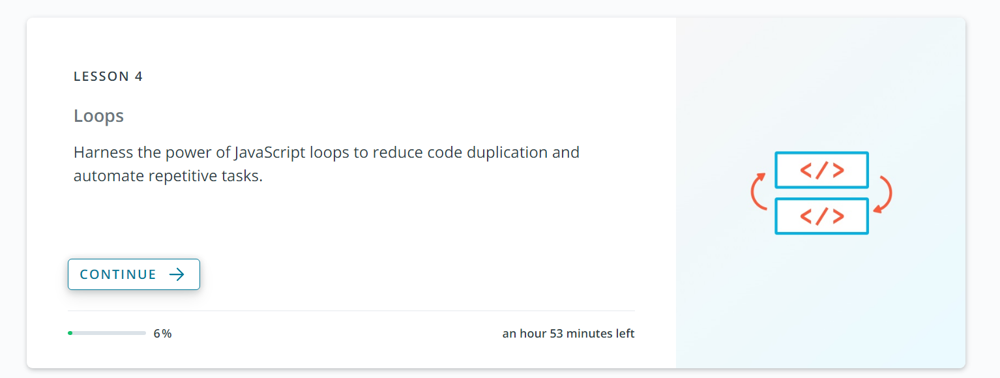

# Les 4: Self Study: Loops (lussen)

## Wat precies doornemen?

De cursus bestaan uit verschillende lessen (lessons). Gelieve Les 4 door te nemen. Ze moeten op 100% staan.

Belangrijk dat je de lessen hiervoor ook al hebt doorgenomen.

Ik zal hier binnenkort nog een test op geven.

Neem de lessen door tot en met Lesson 4
