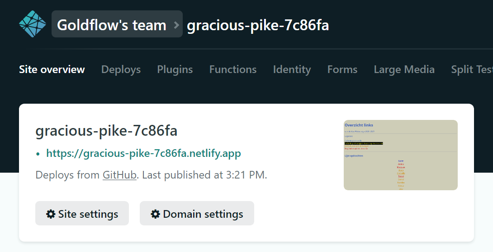

# OPDRACHT: Portfolio op GitHub plaatsen via Netlify

## Leerdoelen:

- software & tools leren gebruiken
  - VS Code
  - GitHub
  - Netlify
  - Git Client
- HTML herhaling
- CSS herhaling
## Vooraleer je aan deze opdracht begint:

- Je hebt een GitHub account
- VS Code is geïnstalleerd met alle plugins ([zie hier voor meer info](../visual-code-extensions.md))
- Je hebt de [lessen van Website Productie 1](https://goldflow.github.io/website-productie/#overzicht-lessen) herhaald als je denkt dat je veel bent vergeten
- Je hebt op zijn minst [Les 1 van Website Productie 2](https://goldflow.github.io/website-productie-2/les_01/) doorgenomen en alle oefeningen tot een goed einde gebracht
## Omschrijving

We gaan de eindopdracht van Website Productie 1 opnieuw gebruiken om enkele nieuwe zaken aan te leren. We gaan onze Portfolio op Github plaatsen en die dan online zetten via Netlify. We zorgen ook dat de portfolio volledig valid is volgens de W3 regels.

## Inhoudelijke vereisten

- Wanneer je op de site komt is het meteen duidelijk dat het een Portfolio is van jou (dus ik verwacht je naam & het woord Portfolio ergens - of een synoniem daarvan)
- Zet er op zijn minst 1 After Effects opdracht in als video.
- Zet op zijn minst 3 Photoshop werkjes in die jij zelf hebt gemaakt
- Zet ook 1 link naar een HTML opdracht (die werkt)
- Alle tekst moet duidelijk leesbaar zijn qua contrast (geen donkergrijs op zwart, of blauw of paars)
- Tekst moet in verhouding zijn met belangrijkheid. Dus het kan niet zijn dat je een menu hebt waarvan de lettergrote kleiner is dan je email adres.
- Navigatie moet een achtergrondkleur krijgen wanneer je erovergaat met je muist ([zie hier hoe dit te doen](https://developer.mozilla.org/en-US/docs/Web/CSS/:hover))
## Technische Vereisten

- foto's / afbeeldingen hou je op gepaste grootte / resolutie (de gebruiker moet niet scrollen om de pagina te zien). Geen afbeeldingen die groter zijn dan een halve MB (500kb) - als je de originele afbeelding erop wil zetten kan je dat doen als een link / href.
- behoud dezelfde pagina's. De mensen die geen Portfolio hebben gemaakt, gelieve mij te contacteren.
- Alle HTML in alle pagina's moet volledig valid zijn volgens W3 regels. **Anders wordt de website niet verbeterd**; zie sectie [Praktisch Advies](../praktisch-advies)
- Maak gebruik van Flexbox als je dit nog niet eerder deed
- Website moet op Github terecht komen
- Maak gebruik van padding waar het past > [zie hier voor meer informatie](https://www.w3schools.com/css/css_padding.asp)
- pas de stijl aan van de `<a>` elementen zodat bij mouse-over of wanneer er geklikt wordt, het niet de standaard stijl heeft; [zie hier hoe dit te doen](https://developer.mozilla.org/en-US/docs/Web/CSS/:hover)
- maak gebruik van een CSS animatie. [Je kan hier vinden hoe je dit doet](https://www.w3schools.com/css/css3_animations.asp). Je mag gerust je daaruit laten inspireren maar kopïeer het niet letterlijk, zal dit controleren. Verander op zijn minst de kleur, snelheid of richting, liefst allemaal. Extra inspiratie kan je vinden [op Codepen](https://codepen.io/tag/css-animation)
- Je zet de website online via Github door gebruik te maken van Netlify. Je kan in [Les 1 terugvinden hoe dit doet (hier klikken)](https://goldflow.github.io/website-productie-2/les_01/#hoe-site-van-github-op-netlify-te-plaatsen)

## Indienen

- .zip / .rar bestand van je verbeterde portfolio in de Uploadzone
- als commentaar geef me je de link naar je website
- geef me ook de **screenshot** van je Netlify pagina zodat ik kan zien dat je het online hebt gezet via Netlify, zie hieronder voor een voorbeeld:

## Vragen / Problemen

Het is de bedoeling dat vanaf deze module iedereen ook gebruik maakt van [het forum van Website Productie 2](https://cvobrussel.smartschool.be/index.php?module=Forum&file=showforum&function=main&courseID=9365&ssID=1711), om zowel dingen te delen als vragen te stellen, en dat de studenten elkaar dan kunnen helpen.

Je mag natuurlijk mij nog steeds aanspreken, maar in de eerste plaats, maak gebruik van [het forum van Website Productie 2](https://cvobrussel.smartschool.be/index.php?module=Forum&file=showforum&function=main&courseID=9365&ssID=1711). Als ik dan een vraag oplos / beantwoord, kunnen je collegacursisten later ook zien hoe hun probleem op te lossen.