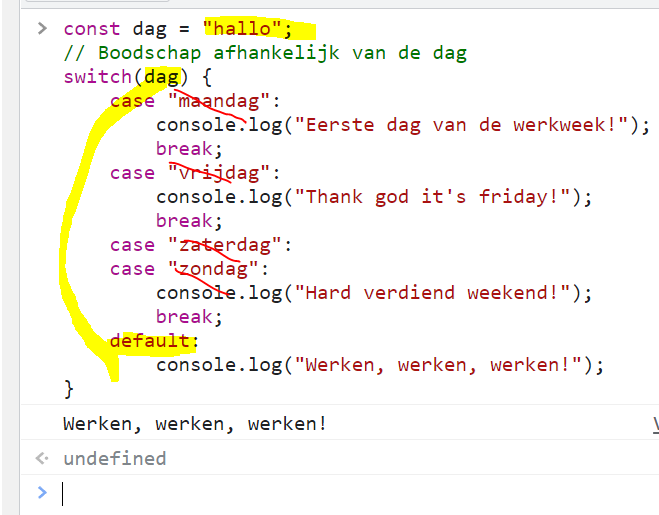

# OPDRACHT: Weather Switch

## Benodigdheden

Neem eerst les 4 door voor je aan deze opdracht begint en doe opdracht Zwart-Wit + 2 kleuren eerst voor je aan deze opdracht begint.

[Download de zip waarmee je de opdracht moet beginnen hier.](https://github.com/Goldflow/website-productie-2/raw/main/opdracht-weather/weather.zip)

## Opzet oefeningen
- Kopieer het bestand in je web-2-taken folder
- doe rechterklik > 7zip > extract here (of "hier uitpakken" voor WinRAR)
- Ga naar Github Desktop
- Open Web2taken repository
- Klik op "Open in Visual Studio Code"

Voor de volgende taken ga je telkens ook de html bestanden downloaden en plaatsen in je map `weather`.

## Uitleg opdracht

Gelijkaardig aan de Zwart-Wit oefening, gaan we opnieuw de achtergrond veranderen van kleur. Maar nu maken we gebruik van "switch" structuur ipv de "if than else" conditionals.

## Indienen

- Maak een zip van de map & dien in bij relevante Uploadzone
- Oefening uploaden in je GitHub repository
- Link maken op de index pagina van Web2taken repository
- Controleer dat de link werkt

## Extra Informatie voor deze opdracht

- [Lijst van enkele tutorials](./praktisch-advies) (onder andere hoe zip in te dienen)
- Link naar les 4 [Les 4](https://goldflow.github.io/website-productie-2/les_04/)
- Bewerkingen uitvoeren: [https://www.studieanker.be/js/004-bewerkingen.html#bewerkingen-uitvoeren](https://www.studieanker.be/js/004-bewerkingen.html#bewerkingen-uitvoeren)
- Condities & Controles: [uitleg switch statement](https://www.studieanker.be/js/005-condities.html#controlestructuur-switch-statement)
- Link naar 2e bron over functies [Studie Anker - functies](https://www.studieanker.be/js/008-functies.html) 

