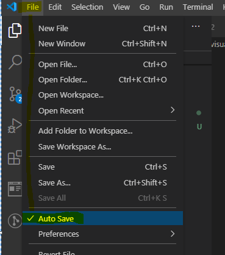
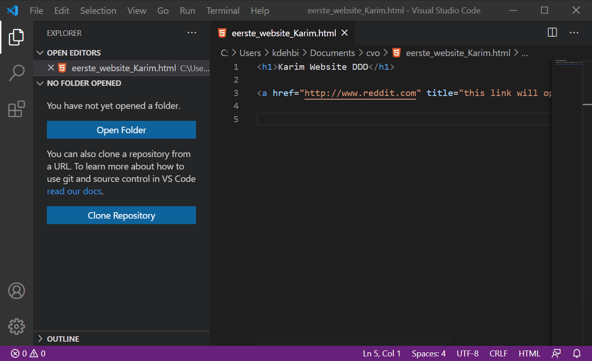

# Visual Studio Code

## Visual Code installatie

Je kan Visual Studio Code hier installeren:
[https://code.visualstudio.com/](https://code.visualstudio.com/)

## Visual Code instellingen

Om efficiënter te werken in VS Code kan bepaalde instellingen aan te passen.

Zodat je niet telkens zelf moet opslaan, kan je gewoon "Auto Save" aanzetten :) 

## Visual Code snelkoppelingen

Om vlotter in VS Code is het goed om snelkoppelingen te gebruiken.

Opslaan / Save:  `ctrl`+`s`

## Visual Code Extensions

Visual Studio Code is in principe een soort van tekstverwerker, maar die heeft allerhande uitbreidingen, die ook wel "plugins" of  "extensions" worden genoemd die de applicatie tot een meer volwaardige tool maken.

Voor deze les gaan we voorlopig de volgende extensies installeren. Je kan ofwel naar de link gaan, maar wat makkelijker is, is binnen Visual Studio Code zelf de extensie installeren.

Kijk bij HTML Preview om te zien hoe dat moet.

### HTML Preview

Met deze extensie kunnen we binnen Visual Studio onmiddelijk de aanpassingen zien die we uitvoeren in Visual Studio Code.

[Hier kan je meer info vinden hoe dit te gebruiken](https://goldflow.github.io/website-productie/les_01/#gebruik-van-html-preview)

### Visual Studio Icons

Met deze extensie kunnen we icoontjes tonen in Visual Studio Code, wat het iets makkelijker maakt om te weten welk bestand voor wat staat.

[https://marketplace.visualstudio.com/items?itemName=robertohuertasm.vscode-icons](https://marketplace.visualstudio.com/items?itemName=robertohuertasm.vscode-icons)

### Path Intellisense

Als je aan software-ontwikkeling werkt, heb je vaak te maken met het bestandssysteem. Gewoonlijk is een andere taak om van context te wisselen tijdens de bewerking van het bestand om het daadwerkelijke bestandspad te bezoeken, het te kopiëren en in VSCode te plakken. De extensie "Path intesllisence" kan je helpen door bestandspaden automatisch aan te vullen wanneer je typt.

[https://marketplace.visualstudio.com/items?itemName=christian-kohler.path-intellisense](https://marketplace.visualstudio.com/items?itemName=christian-kohler.path-intellisense)

### vscode-htmlhint

The HTMLHint extension will run HTMLHint on your open HTML files and report the number of errors on the Status Bar with details in the Problems panel (**View** > **Problems**).

Errors in HTML files are highlighted with squiggles and you can hover over the squiggles to see the error message.

[https://marketplace.visualstudio.com/items?itemName=mkaufman.HTMLHint](https://marketplace.visualstudio.com/items?itemName=mkaufman.HTMLHint)
